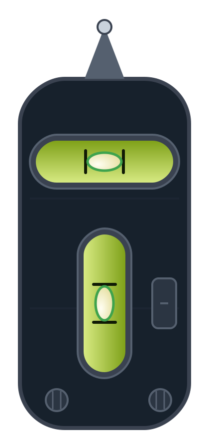
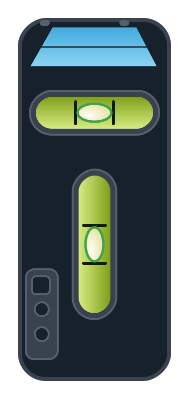

# RV Leveling Card

Eine Lovelace-Karte für Home Assistant: eine Kreuzlibelle (Wasserwaage)
auf einem Fahrzeug-Grundriss – wahlweise **Wohnwagen** (mit Deichsel)
oder **Wohnmobil** (mit Frontscheibe) –, mit der Front nach oben. Zeigt
den aktuellen Neigungswinkel in zwei Achsen (Links/Rechts, Vorne/Hinten)
an und kann per Knopf einen Nullpunkt an einer beliebigen Entity
auslösen (z.B. um den Sensor an der Quelle zu kalibrieren).

| Wohnwagen | Wohnmobil |
|---|---|
|  |  |

Ursprünglich für das [Fridolin-Display-Projekt](https://github.com/floh2111/ha-fridolin-display)
gebaut (ESPHome-Touch-Display + eigene Home-Assistant-Integration),
funktioniert aber mit **jeder** Entity-Kombination, die zwei
Neigungswinkel in Grad liefert – unabhängig von Hersteller oder
Sensor-Typ.

## Voraussetzungen

Zwei `sensor`-Entities mit einem Neigungswinkel in Grad (positive und
negative Werte, z.B. `-3.2` bis `3.2`):

- Neigung **links/rechts**
- Neigung **vorne/hinten**

Optional ein `button` (oder eine andere Entity mit `button.press`), der
auf der Gegenstelle den Nullpunkt setzt/kalibriert. Die Karte selbst
speichert nichts – ein Druck auf "Nullen" ruft nur `button.press` auf
dieser Entity auf.

## Installation über HACS

1. HACS → oben rechts ⋮ → Benutzerdefinierte Repositories.
2. Repository-URL: `https://github.com/floh2111/rv-leveling-card`,
   Kategorie: **Dashboard**.
3. "RV Leveling Card" installieren, Home Assistant neu starten.
4. Die Ressource wird von HACS automatisch unter
   `/hacsfiles/rv-leveling-card/rv-leveling-card.js` eingebunden
   (Lovelace-Ressource wird von HACS selbst verwaltet).

## Karte hinzufügen

Über den Karten-Editor: "Karte hinzufügen" → "Benutzerdefiniert" →
**RV Leveling Card**. Titel, Fahrzeugtyp und die drei Entity-IDs lassen
sich direkt im visuellen Editor einstellen.

Alternativ per YAML:

```yaml
type: custom:fridolin-nivellierung-card
title: Nivellierung
vehicle_type: caravan   # oder: motorhome
entity_lr: sensor.deine_neigung_links_rechts
entity_vh: sensor.deine_neigung_vorne_hinten
entity_zero_button: button.deine_neigung_nullen   # optional
```

> Der interne Element-Typ heißt weiterhin `fridolin-nivellierung-card`
> (Herkunft des Projekts) – das ist kein Tippfehler.

## Konfigurationsoptionen

| Option | Pflicht | Beschreibung |
|---|---|---|
| `title` | nein | Überschrift der Karte (Standard: "Nivellierung") |
| `vehicle_type` | nein | `caravan` (Wohnwagen, Standard) oder `motorhome` (Wohnmobil) |
| `entity_lr` | ja | Sensor Neigung links/rechts (°) |
| `entity_vh` | ja | Sensor Neigung vorne/hinten (°) |
| `entity_zero_button` | nein | Button, der bei "Nullen" gedrückt wird |

## Lizenz

MIT
